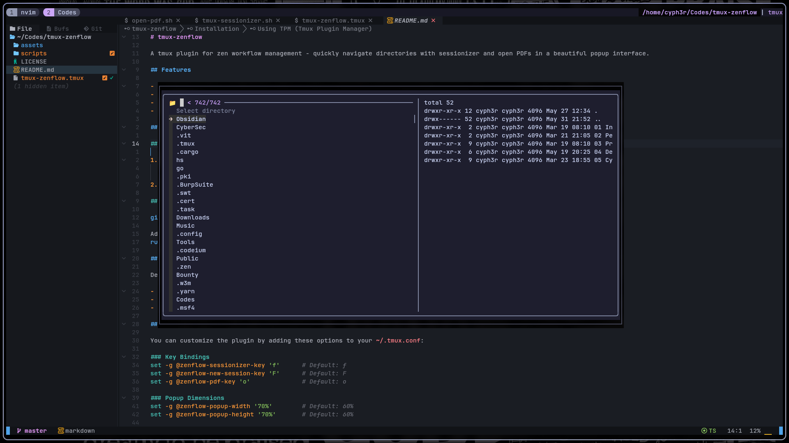
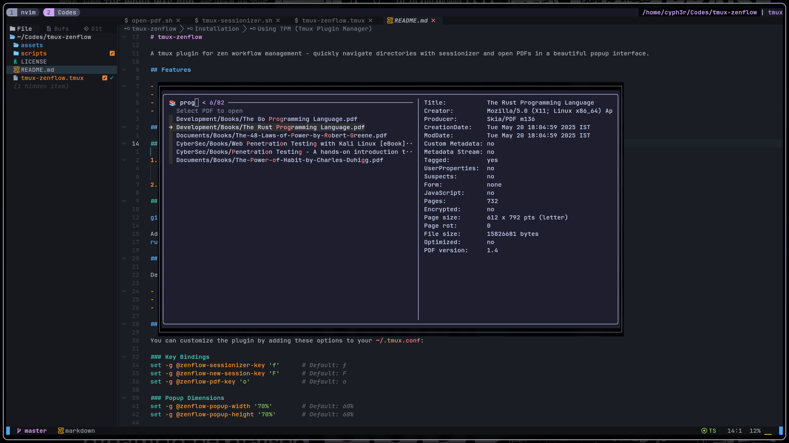

# tmux-zenflow

A tmux plugin for zen workflow management - quickly navigate directories with sessionizer and open PDFs in a beautiful popup interface.




## Features

- **Sessionizer**: Quickly create new tmux sessions or windows from selected directories
- **PDF Opener**: Browse and open PDF files with preview
- **Popup Interface**: Clean, centered popup windows for better UX
- **Highly Configurable**: Customize key bindings, search paths, and appearance

## Installation

### Using TPM (Tmux Plugin Manager)

1. Add plugin to your `~/.tmux.conf`:
   ```bash
   set -g @plugin 'binoymanoj/tmux-zenflow'
   ```

2. Press `prefix + I` to install the plugin.

### Manual Installation

```bash
git clone https://github.com/binoymanoj/tmux-zenflow ~/.tmux/plugins/tmux-zenflow
```

Add to your `~/.tmux.conf`:
```bash
run-shell ~/.tmux/plugins/tmux-zenflow/tmux-zenflow.tmux
```

## Usage

Default key bindings:

- `prefix + f`: Open sessionizer (creates new window in current session)
- `prefix + F`: Open sessionizer (creates new session)  
- `prefix + o`: Open PDF browser

## Configuration

You can customize the plugin by adding these options to your `~/.tmux.conf`:

### Key Bindings
```bash
set -g @zenflow-sessionizer-key 'f'      # Default: f
set -g @zenflow-new-session-key 'F'      # Default: F  
set -g @zenflow-pdf-key 'o'              # Default: o
```

### Popup Dimensions
```bash
set -g @zenflow-popup-width '70%'        # Default: 60%
set -g @zenflow-popup-height '70%'       # Default: 60%
```

### Search Paths
```bash
# Customize directory search paths for sessionizer
set -g @zenflow-search-paths '~/ ~/.config ~/Projects ~/Work'

# Customize PDF search paths  
set -g @zenflow-pdf-paths '~/Documents/Books ~/Downloads'
```

### PDF Viewer
```bash
set -g @zenflow-pdf-viewer 'evince'      # Default: zathura
```

## Default Search Paths

### Sessionizer
- `~/` (home directory)
- `~/.config`
- `~/Bounty`
- `~/Codes` and subdirectories
- `~/CyberSec`
- `~/Development`
- `~/Documents`
- `~/Downloads`
- `~/Music`
- `~/Obsidian`
- `~/Pictures`
- `~/Tools`
- `~/Videos`

### PDF Browser
- Current pane directory
- `~/CyberSec/Books`
- `~/Documents/Books`  
- `~/Development/Books`

## Requirements

- tmux 3.0+ (for popup support)
- [fzf](https://github.com/junegunn/fzf) - fuzzy finder
- `pdfinfo` (optional, for PDF previews)
- `zathura` or another PDF viewer

## Tips

- The sessionizer will create unique names for sessions/windows if duplicates exist
- PDF viewer opens in a new tmux window and returns you to the previous window
- Use custom search paths to speed up navigation to your most-used directories
- Popup windows are centered and sized for optimal viewing

## Contributing

Feel free to open issues or submit pull requests to improve the plugin!

## License

MIT License
